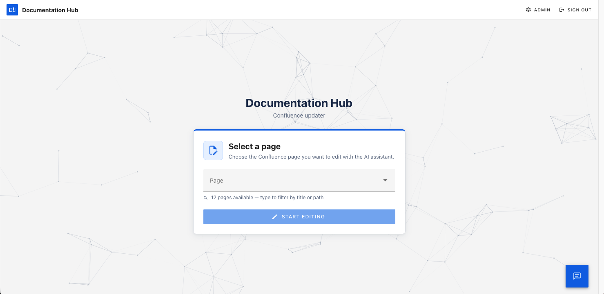

# Page Crafter

AI-assisted documentation manager for Atlassian Confluence Data Center.
Syncs pages, indexes them for semantic search, generates Markdown drafts via LLM, renders a live Confluence preview, and publishes only after human review.



## Features

- **Sync** — mirrors a Confluence space into a local PostgreSQL database
- **RAG chat** — ask questions about your documentation via LightRAG
- **Page editor** — generate or manually edit Markdown, see a Confluence-rendered diff before publishing
- **LLM proposals** — queue targeted AI rewrites without touching the current draft
- **Job tracking** — every async operation is observable with granular progress events
- **Auth** — Keycloak OIDC/PKCE, role-based (`admin`, `editor`, `reader`, `chat`)

## Stack

| Layer          | Technology                              |
| -------------- | --------------------------------------- |
| Frontend       | Vue 3, TypeScript, Vuetify, Keycloak-js |
| API            | FastAPI, Python 3.13, pydantic-settings |
| Worker         | Celery, LangChain, LangGraph            |
| Database       | PostgreSQL 16                           |
| Cache / broker | Redis 7                                 |
| RAG engine     | LightRAG                                |
| Auth           | Keycloak 26                             |
| Runtime        | Docker, uv, FastAPI static serving      |

## Quick start

### Prerequisites

- Docker 24+ and Docker Compose v2
- A running Confluence Data Center instance and a Personal Access Token
- OpenAI API key **or** a local [Ollama](https://ollama.com) instance

### 1. Configure

```bash
cp .env.example .env
# Required: CONFLUENCE_PAT, OPENAI_API_KEY (or Ollama settings)
```

Frontend browser configuration lives in `apps/web/public/config.json`. The Docker build copies it into the Vue bundle served by FastAPI.

### 2. Start infrastructure

```bash
docker compose up -d postgres redis keycloak lightrag
```

### 3. Build and run

```bash
docker compose build
docker compose up -d
```

| Service  | URL                        |
| -------- | -------------------------- |
| Frontend | http://localhost:8000      |
| API docs | http://localhost:8000/docs |
| Keycloak | http://localhost:8080      |

Default login: **admin / password**

## Local development

Run infrastructure in Docker, apps on the host:

```bash
# Infrastructure
docker compose up -d postgres redis keycloak lightrag

# Backend API (hot-reload)
uv sync --all-packages
uv run uvicorn cm_api.main:app --reload --app-dir apps/api/src

# Worker
uv run celery -A cm_worker.celery_app worker --loglevel=info

# Beat scheduler (nightly sync)
uv run celery -A cm_beat.celery_app beat --loglevel=info

# Frontend
npm install
npm run dev:web   # http://localhost:5173, proxies /api to localhost:8000
```

## Repository layout

```none
apps/
  api/        FastAPI application (cm-api)
  beat/       Celery Beat scheduler (cm-beat)
  worker/     Celery worker (cm-worker)
  web/        Vue 3 frontend
packages/
  shared/     Shared ORM models, Pydantic schemas, settings (cm-shared)
docker/
  keycloak/   Realm import JSON
docs/         Architecture, configuration, API reference, deployment guide
```
